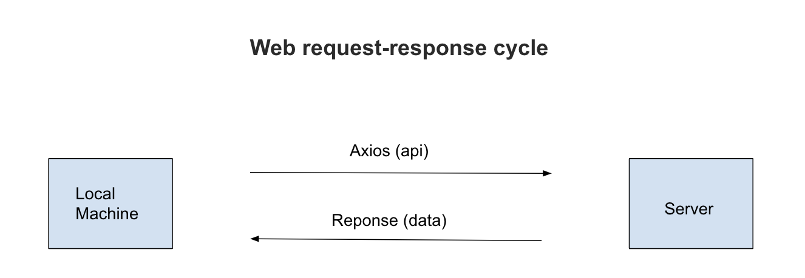
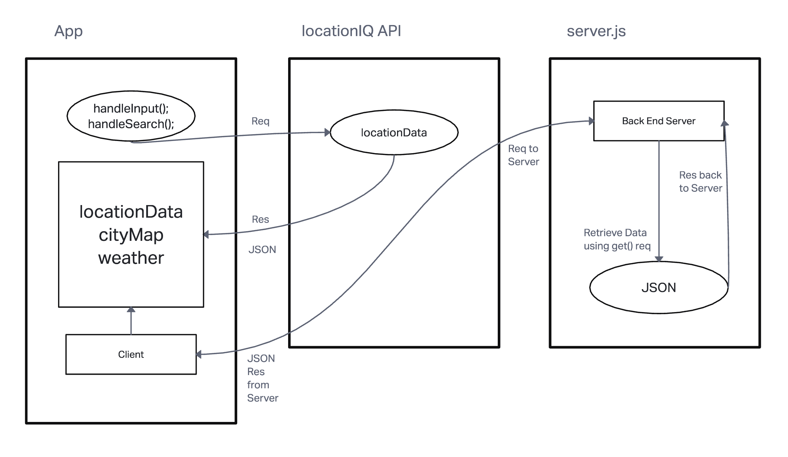
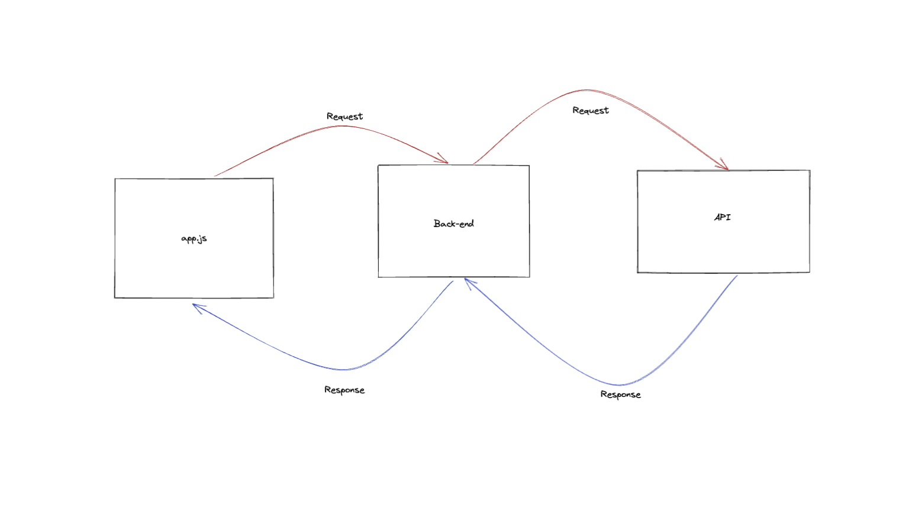

# City Explorer

## Process

**Author**: Diego Sousa
**Version**: 1.0.0 

## Overview

This is a web application that allows users to search for a location using the ``Location IQ Gedocoding API``, and to view a map of the area and any associated lore. The application will also allow users to search for specific events based on the location they have provided.

## Getting Started

1. Clone the repository from GitHub.
2. Install the dependencies using ``npm i``.

## Architecture

This application is built using React, Bootstrap, and Axios.

## Change Log
<!-- Use this area to document the iterative changes made to your application as each feature is successfully implemented. Use time stamps. Here's an example:

01-01-2001 4:59pm - Application now has a fully-functional express server, with a GET route for the location resource. -->

## Credit and Collaborations
<!-- Give credit (and a link) to other people or resources that helped you build this application. -->

## Time Estimates

Name of feature:  Set up your React repository & API keys.

Estimate of time needed to complete: 30 minutes

Start time: 5:00pm EST

Finish time: 5:20pm EST

Actual time needed to complete: 20 minutes

===========================================================================

Name of feature:  Locations

Estimate of time needed to complete: 30 minutes

Start time: 5:20pm EST

Finish time: 6:20pm EST

Actual time needed to complete: 1 hour

===========================================================================

Name of feature:  Map of the city.

Estimate of time needed to complete: 30 minutes

Start time: 6:30pm EST

Finish time: 7:40pm EST

Actual time needed to complete: 1 hour 10 minutes

===========================================================================

Name of feature:  Error messages.

Estimate of time needed to complete: 10 minutes

Start time: 7:40pm EST

Finish time: 8:10pm

Actual time needed to complete: 30 minutes

===========================================================================

Name of feature:  Weather

Estimate of time needed to complete: 30 minutes

Start time: 7:00pm EST

Finish time: 8:00pm EST

Actual time needed to complete: 1 hour

===========================================================================

Name of feature:  Movies

Estimate of time needed to complete: 30 minutes

Start time: 8:00pm EST

Finish time: 8:30pm EST

Actual time needed to complete: 30 minutes

===========================================================================

Name of feature:  Refactoring components and nesting extra components.

Estimate of time needed to complete: 30 minutes

Start time: 6:00pm EST

Finish time: 8:00pm EST

Actual time needed to complete: 2 hours

===========================================================================
